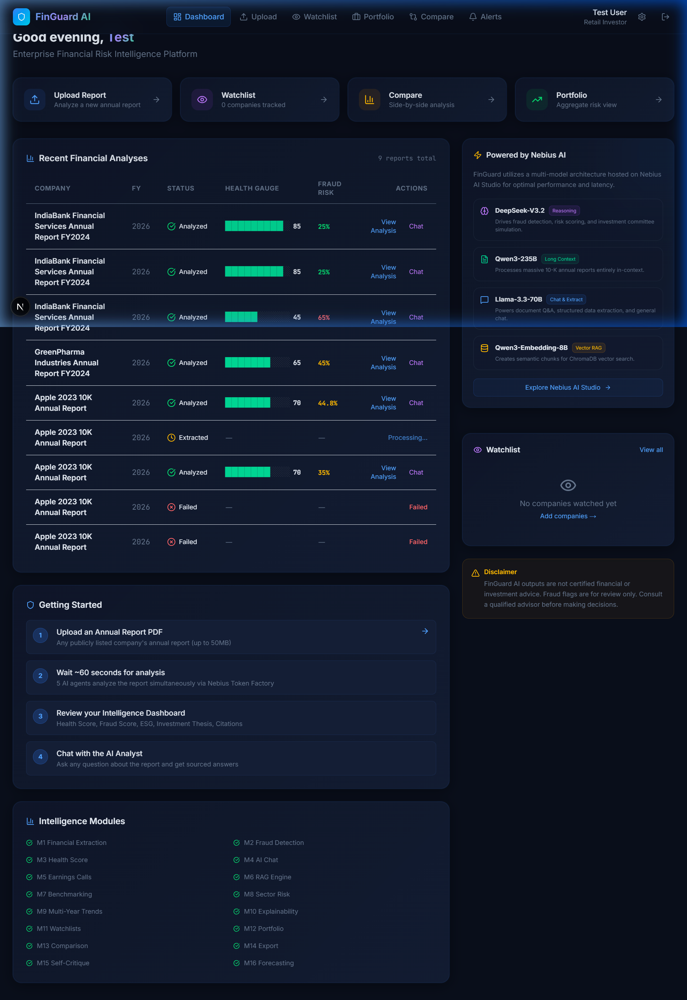
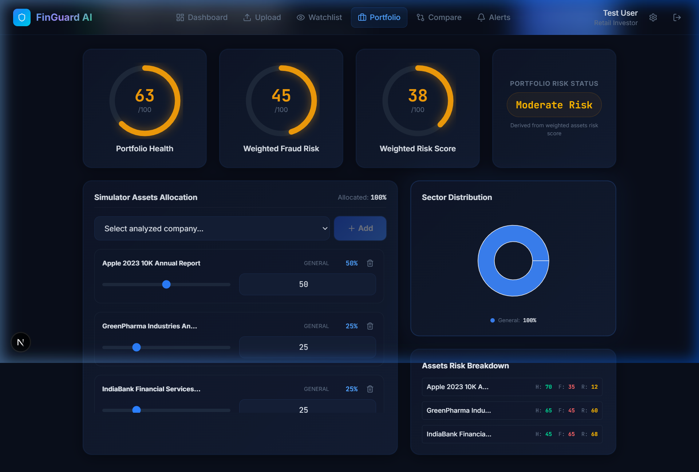

# 🛡️ FinGuard AI — Enterprise Financial Risk Intelligence Platform

[](https://github.com/Sdcodsjs/Finguard-Ai)

> **Bloomberg Terminal Lite + Moody's Risk Analytics + AI Fraud Detection**
> 
> *Powered by State-of-the-Art Open Models hosted on Nebius Token Factory (DeepSeek-V3.2, Qwen-235B, Llama-3.3, and Qwen-Embedding)*

---

FinGuard AI is a comprehensive financial intelligence and risk audit platform. It ingests complex annual reports (PDFs), processes them through a multi-agent consensus system, indexes content into a vector database (ChromaDB), and extracts critical ratios, red flags, and ESG metrics into a unified, glassmorphic research console.

---

## 🚀 Key Features

*   **📊 Interactive Scenario Simulator (New):** Play out "What-If" scenarios on company financials. Adjust sliders for Revenue, Operating Expenses, and Debt levels to see simulated Current Ratios, D/E ratios, Net Profit Margins, and ROE recalculate instantly offline.
*   **📂 Portfolio-Wide RAG Chat (New):** Query and compare financial profiles, risks, and performance metrics across multiple company reports simultaneously in a unified comparative chat console.
*   **📝 Investment Memo Generator (New):** Compile complete credit and investment committee briefs. Generates a publication-grade PDF using Python's `ReportLab` library, automatically appending the AI-generated Bull/Bear thesis, key drivers, risk mitigations, and fraud indicators.
*   **⚠️ Multi-Agent Fraud Consensus:** A 5-agent jury system (Financial Analyst, Fraud Investigator, Risk Auditor, ESG Analyst, and Investment Advisor) running on Nebius Open Models that audits accounting inconsistencies, auditor shifts, and red flags.
*   **🔎 RAG & Contextual Citations:** Ask complex questions about reports and get source-grounded answers linking directly back to page numbers.
*   **🌱 ESG Scorecards:** Evaluates corporate governance, environmental impact, and social policies using specific sections of the annual report.

---

## 📸 Project Preview & Screenshots

### Interactive Research Dashboard


### Portfolio Analytics & Simulator Control Panel



---

## 🏗️ System Architecture

```
FinGuard AI
├── backend/                  # FastAPI + Python
│   ├── main.py               # App entry point & Router registration
│   ├── config.py             # Settings (all model names from env)
│   ├── ai/
│   │   ├── agents.py         # 5-agent multi-agent system + Consensus Engine
│   │   └── prompts.py        # Versioned prompt library
│   ├── services/
│   │   ├── nebius_client.py  # Nebius Token Factory client (5-tier routing)
│   │   ├── pdf_extractor.py  # OCR pipeline (PyMuPDF + Tesseract)
│   │   ├── financial_parser.py # Metric extraction + ratio computation
│   │   ├── ratio_engine.py   # Mathematical financial ratio engine
│   │   ├── auth_service.py   # JWT auth + RBAC
│   │   └── export_service.py # ReportLab PDF export (Investment Memo)
│   ├── rag/
│   │   └── rag_service.py    # ChromaDB + Nebius embeddings
│   ├── api/
│   │   ├── auth.py           # /api/auth/*
│   │   ├── reports.py        # /api/reports/* (Upload & Ingestion)
│   │   ├── analysis.py       # /api/analysis/* (Ratio logic & Simulator data)
│   │   └── chat.py           # /api/chat/* (SSE streaming & Portfolio Chat)
│   ├── db/
│   │   ├── models.py         # Full SQLAlchemy schema (24-module)
│   │   └── database.py       # Async SQLite engine
│   └── jobs/
│       └── pipeline.py       # Background pipeline (OCR → RAG → Agents → Store)
│
└── frontend/                 # Next.js 15 + TypeScript + TailwindCSS
    ├── app/
    │   ├── page.tsx          # Landing page
    │   ├── auth/             # Login + Signup
    │   └── (app)/            # Protected app pages
    │       ├── dashboard/    # Portfolio list and metrics dashboard
    │       ├── upload/       # PDF Report upload
    │       ├── analysis/     # [reportId] -> Visual gauges, metrics & Scenario Simulator
    │       ├── chat/         # [reportId] -> Report-grounded AI Chat
    │       ├── portfolio/    # Portfolio simulator controls & portfolio-wide AI Chat
    │       ├── watchlist/    # Company stock watchlist
    │       ├── compare/      # Side-by-side benchmarking
    │       ├── alerts/       # Ratio breaches and red flag rule settings
    │       └── settings/     # Admin configurations
    ├── components/
    │   ├── ScoreRing.tsx     # Animated SVG score gauge
    │   ├── ExplainabilityPanel.tsx # Citation viewer (Module 10)
    │   └── Navbar.tsx        # Top navigation
    └── lib/
        ├── api.ts            # Centralized API fetch client
        ├── utils.ts          # Score colors, formatters
        └── auth-context.tsx  # Authentication state provider
```

---

## 🤖 AI Architecture — Nebius Token Factory

**ALL AI inference runs on Open Models via Nebius Token Factory.**

| Tier | Purpose | Module & Active Model |
| :--- | :--- | :--- |
| **Reasoning** | Fraud detection, investment recommendation, self-critique | `deepseek-ai/DeepSeek-V3.2` (M2, M5, M15) |
| **Long Context** | Annual report analysis, MD&A YoY diff | `Qwen/Qwen3-235B-A22B-Instruct-2507` (M1, M9, M19) |
| **Extraction** | Metric extraction, sentiment, classification | `meta-llama/Llama-3.3-70B-Instruct` (M1, M5) |
| **Chat** | AI Investor Assistant & Portfolio comparative chat | `meta-llama/Llama-3.3-70B-Instruct` (M4) |
| **Embedding** | RAG, semantic vector search | `Qwen/Qwen3-Embedding-8B` (M6) |

### Multi-Agent Pipeline:
1.  **Financial Analyst Agent:** Extracts revenue, margins, growth, and checks top-line metrics.
2.  **Fraud Investigator Agent:** Detects red flags, earnings quality issues, and accounting manipulation.
3.  **Risk Auditor Agent:** Evaluates leverage (D/E), solvency, liquidity, and overall distress risks.
4.  **ESG Analyst Agent:** Reviews ESG ratings, policies, and governance structures.
5.  **Investment Advisor Agent:** Synthesizes Bull/Bear cases and long-term outlook.
6.  **Consensus Engine:** Weighted aggregate score scoring.
7.  **Self-Critique Engine (Module 15):** Validates all extracted figures against raw financial statement balances to prevent hallucinations.

---

## 📋 Platform Modules

| # | Module | Status |
| :--- | :--- | :--- |
| **M1** | Financial Statement Analyzer | ✅ |
| **M2** | Fraud Detection Engine | ✅ |
| **M3** | Financial Health Score | ✅ |
| **M4** | AI Investor Chat (SSE) | ✅ |
| **M5** | Earnings Call Analyzer | ✅ |
| **M6** | RAG Engine (ChromaDB) | ✅ |
| **M7** | Peer Benchmarking (Compare) | ✅ |
| **M8** | Sector Intelligence | ✅ |
| **M9** | Multi-Year Trends | ✅ |
| **M10**| Explainability + Citations | ✅ |
| **M11**| Watchlists | ✅ |
| **M12**| Portfolio Analytics | ✅ |
| **M13**| Comparison Mode | ✅ |
| **M14**| Export Engine (PDF) | ✅ |
| **M15**| Self-Critique Engine | ✅ |
| **M16**| Financial Forecasting | ✅ |
| **M19**| Document Diff (MD&A) | ✅ |
| **M20**| Custom Alert Rules | ✅ |
| **M21**| API Key Management | ✅ |
| **M22**| Multi-Currency Normalization | ✅ |
| **M23**| Collaborative Annotations | ✅ |

---

## 🚀 Quick Start (Local Setup)

### 1. Configure Nebius Token Factory
Copy the environment variables template and fill in your keys:
```bash
cd backend
cp .env.example .env
```

Edit `backend/.env` to include your configuration:
```env
NEBIUS_API_KEY=your_key_here
NEBIUS_BASE_URL=https://api.tokenfactory.nebius.com/v1/

# Routing models
NEBIUS_REASONING_MODEL=deepseek-ai/DeepSeek-V3.2
NEBIUS_LONG_CONTEXT_MODEL=Qwen/Qwen3-235B-A22B-Instruct-2507
NEBIUS_EXTRACTION_MODEL=meta-llama/Llama-3.3-70B-Instruct
NEBIUS_CHAT_MODEL=meta-llama/Llama-3.3-70B-Instruct
NEBIUS_EMBEDDING_MODEL=Qwen/Qwen3-Embedding-8B
```

### 2. Start Backend (FastAPI)
```bash
cd backend
py -m pip install -r requirements.txt
py -m uvicorn main:app --reload --port 8000
```

### 3. Start Frontend (Next.js)
```bash
cd frontend
npm install
npm run dev
```
Open: [http://localhost:3000](http://localhost:3000)

*Note: On Windows, you can alternatively double-click the **`start.bat`** launcher at the project root to start both servers automatically.*

---

## 🌐 Production Deployment Guide

### Frontend — Deploying on Vercel
Deploy the frontend (Next.js) directly to Vercel:
1. Connect your repository to **Vercel**.
2. Set the root directory to `frontend`.
3. Add the following environment variable:
   - `NEXT_PUBLIC_API_URL` = `https://your-backend-render-url.onrender.com`

### Backend — Deploying on Render (with Persistent Disk)
Since the backend uses SQLite, ChromaDB, and local PDF uploads, deploy to Render with a **Persistent Disk** to ensure database persistence:

1. Create a **Web Service** on Render pointing to the `/backend` directory.
2. In the settings, go to the **Disks** tab and click **Add Disk**:
   - Name: `finguard-storage`
   - Mount Path: `/data`
   - Size: `5 GB`
3. Add the following **Environment Variables** under the Environment tab:
   - `DATABASE_URL` = `sqlite+aiosqlite:////data/finguard.db`
   - `UPLOAD_DIR` = `/data/uploads`
   - `CHROMA_PERSIST_DIR` = `/data/chroma_db`
   - `EXPORT_DIR` = `/data/exports`
   - `ENVIRONMENT` = `production`
   - `NEBIUS_API_KEY` = `your_nebius_api_key`
   - `NEBIUS_BASE_URL` = `https://api.tokenfactory.nebius.com/v1/`
   - `SECRET_KEY` = `your_jwt_signing_secret`
   - `CORS_ORIGINS` = `https://your-frontend.vercel.app` (restricts access to your frontend)

---

## 🛡️ Security Audit Standards (Implemented)
- **Path Traversal Mitigation:** Report PDF uploads are sanitized using `os.path.basename` to prevent arbitrary file writes outside the designated upload directory.
- **Secure Logging:** No API keys or sensitive JWT secrets are written to logs; all configurations are safely injected via environment variables.
- **SQL Injection Prevention:** Database queries utilize SQLAlchemy ORM parameterized statements.

---

## ⚠️ Disclaimer

FinGuard AI is an analytical research platform. All ratings, health scores, and outlooks are AI-generated perspectives and do not constitute certified financial, legal, audit, or investment advice.
